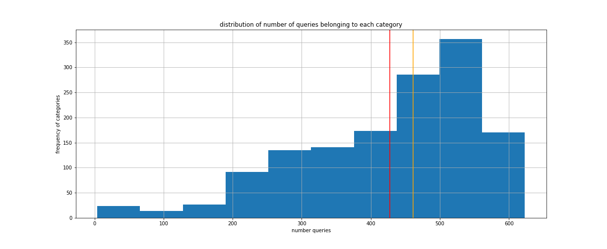
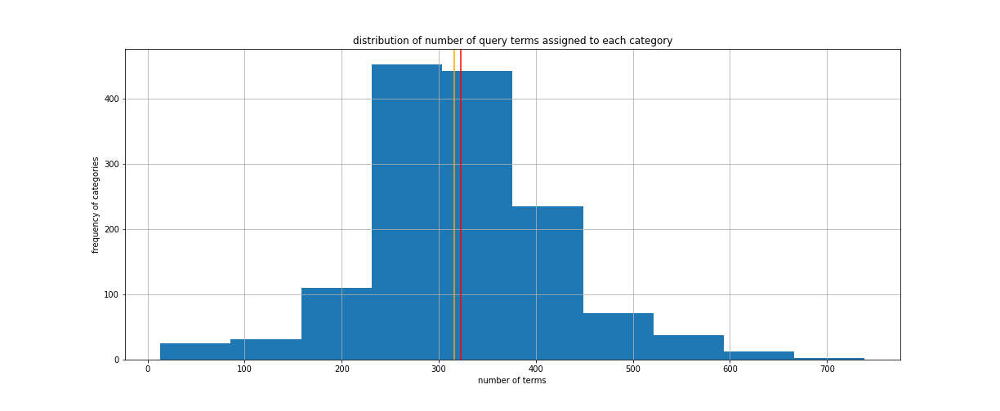

search_term_clustering
===
# introduction
code for a coding challenge accompanying a job application. the task is to build a model to predict which category an unseen search term belongs, using a labelled data set mapping many search terms and their categories. 

# how-to:
get you copy from github and then generate `data/` and `models/` folders (not included in this repo), and then populate these with input data from `s3`:
```
git clone https://github.com/oh-data-sci/search_term_classification
cd search_term_classification
./setup_folders.sh
```
the model's output on holdout data should be in the `output/` folder. to produce the model output, it should be enough to

- 1) set up your python environment with `pipenv`
- 2) launch a pipenv shell
- 3) execute the python script `run.py` from within the `src/` folder. 
```
pipenv install
```
```
pipenv shell
cd src/
python run.py
```

read on for details. additionally, you might want to explore the jupyter notebooks that explain the experimentation process. 

# solution overview:
- exploratory phase:
	+ establish a search term vocabulary from the labelled data. 
	+ estimate coverage of labelled data compare unlabelled set vocabulary. 
	+ confirm that training set has a feasible handle on the problem space
- data preparation phase:
	+ determine data is clean (all lowercase, all punctuation-free, etc.)
	+ split data up into testing and training data
- model building phase:
	+ experiment with a handful of (inherently multiclass) classification algorithms
	+ choose an algorithm and tune its hyperparameters
	+ retrain optimal performing model on full input dataset.
- model running phase
	+ run tuned, retrained model on provided unlabelled data
- speculate about improvements

# data
## input
- remote training data: `https://s3-eu-west-1.amazonaws.com/adthena-ds-test/trainSet.csv`
- remote unlabelled data: `https://s3-eu-west-1.amazonaws.com/adthena-ds-test/candidateTestSet.txt`
- fetch remote data using `src/fetch_data.sh` which 
	+ creates the `data` folder and relevant subfolders
	+ then copies remote data to `data/raw/`
## data products
- labelled data split:
	+ `data/processed/train.csv`
	+ `data/processed/test.csv`
- category summarization

## results
- `output/candidateTestSet_with_categories.csv`
- see also model object: `models/final_model_object.pckl`
- and `tf-idf` preprocessing object: `models/preprocessing.pckl`

# code overview
## python scripts
- ~~helper functions: `src/utilities.py`~~
- model builder: `src/model_build.py`
- run script: `src/run.py`

## (exploratory) notebooks 
- exploratory analysis: `notebooks/001_eda.ipynb`
- train/test data split: `notebooks/002_train_test_split.ipynb`
- model algorithm explorations:
	+ random forest: `101_randomforest.ipynb`
	+ support vector machine: `102_support_vector_machine.ipynb`
	+ gradient boosting machine classification: `103_hist_grad_boost.ipynb`
	+ histogram based gradient boosting classification: `103_hist_grad_boost.ipynb`
	+ naive bayes: ``
- model tuning:

# method
the method demonstrated here is, in short:

- explore the labelled data and the unlabelled data to gauge feasibility, and learn about the problem space
- split labelled data into testing and training sub sets, 
- train and evaluate multiple models, 
- determine the best model, and optimise its hyperparameters.
- retrain optimal model parameters on the full input data 
- apply resulting full, optimal model to unlabelled data. 

# results
the performance of the resulting model is useful but not great. this is unsurprising given that:

- the problem has high feature dimensionality (raw vocabulary size >70k)
- there are a very high number of categories, about 1500
- the labelled data set is quite imbalanced, with number of queries to each category ranging from 4 (!) to over 600. 
- there is a significant overlap in occurence of terms in queries of different categories, complicating a bag of words approach
- a glance at the labelled data is enough to surface oddities in the labelling - even without knowing the category meanings. 
- for the minority categories, any pattern will be very hard to learn, and the benefit is questionable.

. 

the situation is a little better when we consider the number of terms per category, but these still range widely.


consolidating the smallest minority categories into an 'other' metacategory is an option. this would simplify the problem and improve the model predictions, albeit while adding a challenging heterogeneous metacategory. new queries assigned by the model to that metacategory could be handled differently in the front end: (e.g. ask the user for clarification, default with reference to most popular). 

considering that not all misclassifications are equally bad (categories may overlap conceptually and share frequent terms), another option for consolidating categories would be to first identify the most similar categories, then, for every category pair that are similar and at least one of them is a minority category. a way to do this would be to use a freely available language model (e.g. bert, distilbert) to embed labelled queries into a semantic space. then one could use a dimension reduction like `pca` or `umap` for reducing this this space. finally, the running a clustering algorithm (e.g. `louvain`, `hdbscan`, or even `k-means`) one could find candidate category pairs to combine. 

another path forward could be to reduce the feature dimensionality of the `tfidf` vectorized features, reducing time and memory needed for the training and evaluation of the models. 

finally, considering the task complexity, high dimensionality of features, and large set of labelled data, this task is a candidate for deep learning solutions, though i have not attempted any of those here. 

# project organization
---

    ├── LICENSE
    ├── README.md          <- this file. a top-level description.
    ├── setup_folders.sh   <- bash script to make missing data folder and populate with datafiles from s3-bucket
    │
    ├── data               <- not included in this git repo. can be autogenerated with setup_folders.
    │   ├── processed      <- location of interim data producs generated and used
    │   ├── output         <- folder containing unseen search terms mapped to assigned categories
    │   └── raw            <- location of the input data as provided (not included in git repo)
    │
    ├── models             <- trained and serialized models (pickle)
    │
    ├── notebooks          <- jupyter notebooks for experiements. names begin with a number (indicating ordering), 
    │                         followed by description of action e.g. `001_eda.ipynb`, `002_train_test_split.ipynb`
    │
    ├── references         <- other explanatory materials.
    │
    ├── output             <- Generated analysis as HTML, PDF, LaTeX, etc.
    │   └── figures        <- Generated graphics and figures to be used in reporting
    │
    ├── Pipfile            <- a list of external (open source) module and library requirements file for reproducing the analysis environment
    │
    ├── setup.py           <- makes project pip installable (pip install -e .) so src can be imported.
    │
    ├── src                <- source code for use in this project.
    │   ├── __init__.py    <- Makes src a Python module
    │   ├── train_model.py <- defines model training functions
    │   ├── run_model.py   <- run this to produce output
    │   ├── utilities.py   <- useful utility functions

---

# ps
## lessons learned
- random forest classifier, which usually performs really well, is very resource intensive for this use case, unless when vocabulary size is drastically reduced. 
- naive bayes, known for document classification, is very resource intensive for this size of projects - out of memory errors.
- gradient boosting machine is not appropriate for this task, even with the newer, polished histogram based gradient boosting. 
- of attempted methods, only support vector machines, with reasonable parameter settings, succeeds adequately.
- high number of minority gategories problematic. category consolidation possibly useful.
- deep learning methods should be considered. 